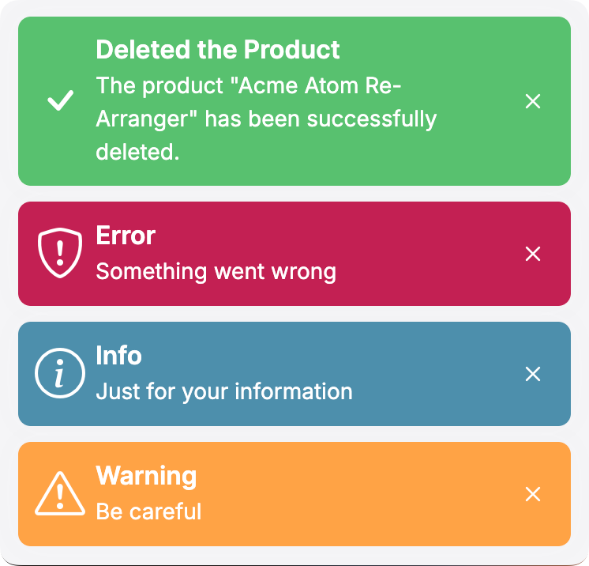

# ASP.NET Core MVC / Razor Pages UI: JavaScript Notify API

Notify API is used to show toast style, auto disappearing UI notifications to the end user. 

## Quick Example

Use `abp.notify.success(...)` function to show a success message:

````js
abp.notify.success(
    'The product "Acme Atom Re-Arranger" has been successfully deleted.',
    'Deleted the Product'
);
````

A notification message is shown at the bottom right of the page:



## Notification Types

There are four types of pre-defined notifications;

* `abp.notify.success(...)`
* `abp.notify.info(...)`
* `abp.notify.warn(...)`
* `abp.notify.error(...)`

All of the methods above accept the following parameters:

* `message`: A message (`string`) to show to the user.
* `title`: An optional title (`string`).
* `options`: Additional options to customize the notification. Available options:
  * `life`: Display duration in milliseconds (default: `5000`)
  * `sticky`: Keep toast visible until manually closed (default: `false`)
  * `closable`: Show close button (default: `true`)
  * `tapToDismiss`: Click anywhere on toast to dismiss (default: `false`)
  * `containerKey`: Key for multiple container support (optional)
  * `iconClass`: Custom icon class (optional)
  * `position`: Position configuration (optional)
    * `top`: Distance from top (default: `'auto'`)
    * `right`: Distance from right (default: `'30px'`)
    * `bottom`: Distance from bottom (default: `'30px'`)
    * `left`: Distance from left (default: `'auto'`)

## Global Configuration

`AbpToastService.setDefaultOptions` method can be used to set default options for all notifications. This method should be called before any notification is shown.
